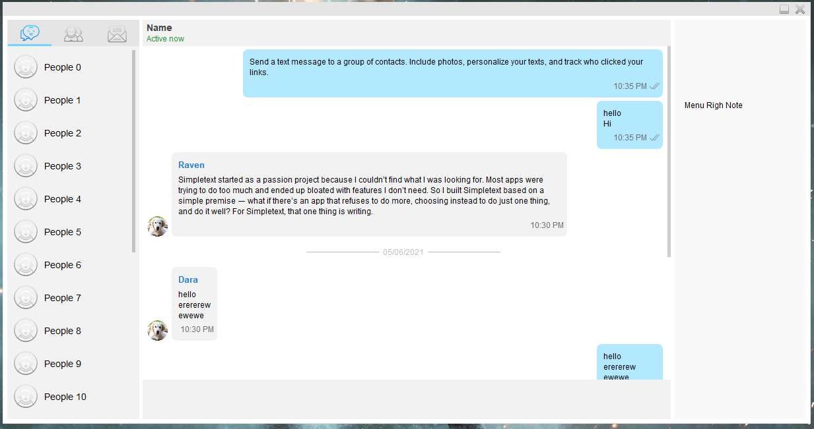
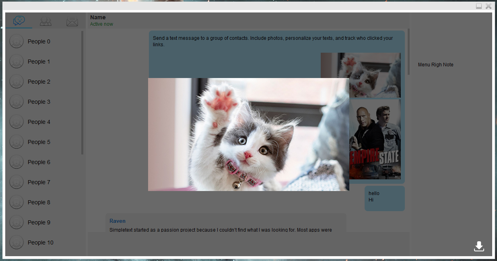
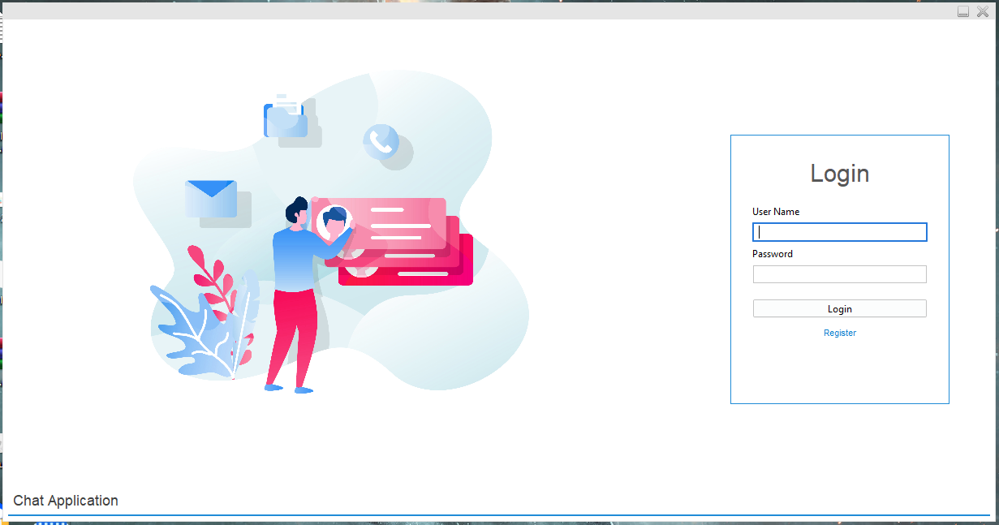
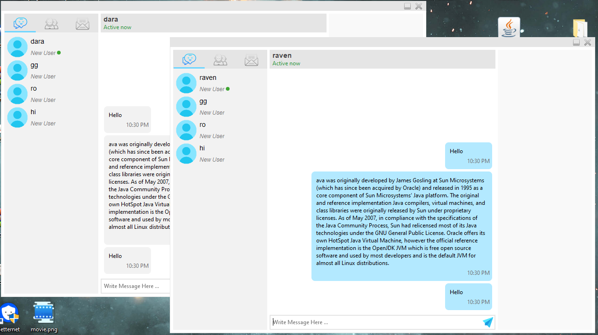

# Java Swing Chat appication

This is a stand-alone desktop-based Chatting Application implemented using Java Swing, AWT, and Java Networking. It is a Server-Client model-based application and is a good example of using java.io, java.net package to create a chat application It also includes Login and register screen for the user to register to the application.

This project aims to express how we can implement a simple chat application between a server and a client. The application is desktop-based and is implemented using Swing and AWT.

##  Its functionalities include :

a. Sending text messages between Server and Client.

b. Clean interface with proper alignment of text.

c. Speech bubble feature.

d. Scrollbar.

## Screenshot

## Conclusion
This project is a basic chatting application with all the necessary functionalities like sending text messages between server and client, speech bubble feature, scrollbar, etc, built using Java Swing, Java AWT, Java Networking. This is a desktop-based application with unique features and is easily customizable. Java.net package has been used which provides a wide range of classes for developing networking applications. The most commonly used networking protocols for messaging over a network are TCP and UDP. TCP is a connection-oriented protocol that enables applications to exchange messages over the network. Alternative to TCP is UDP as it is a low latency protocol with less transmission time.
